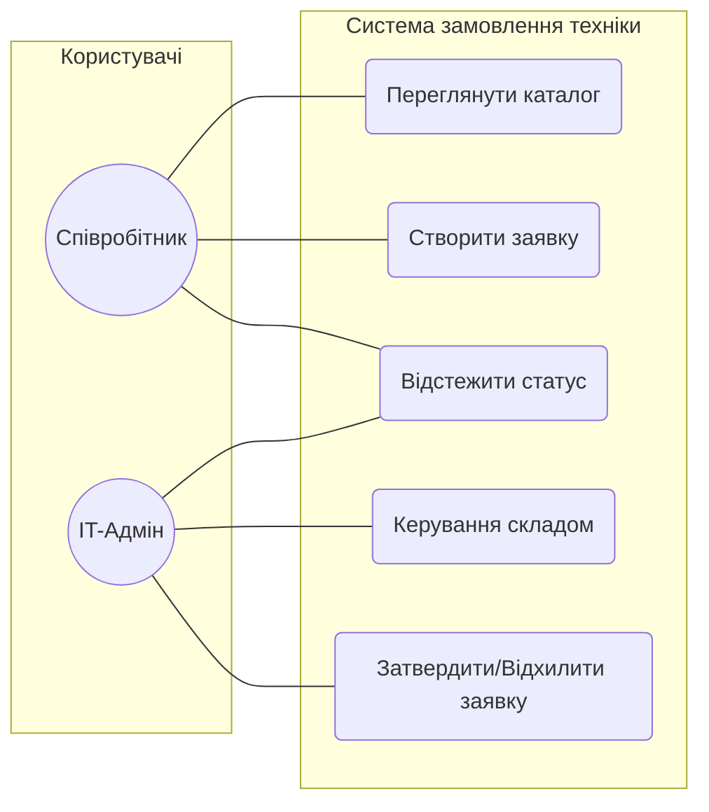
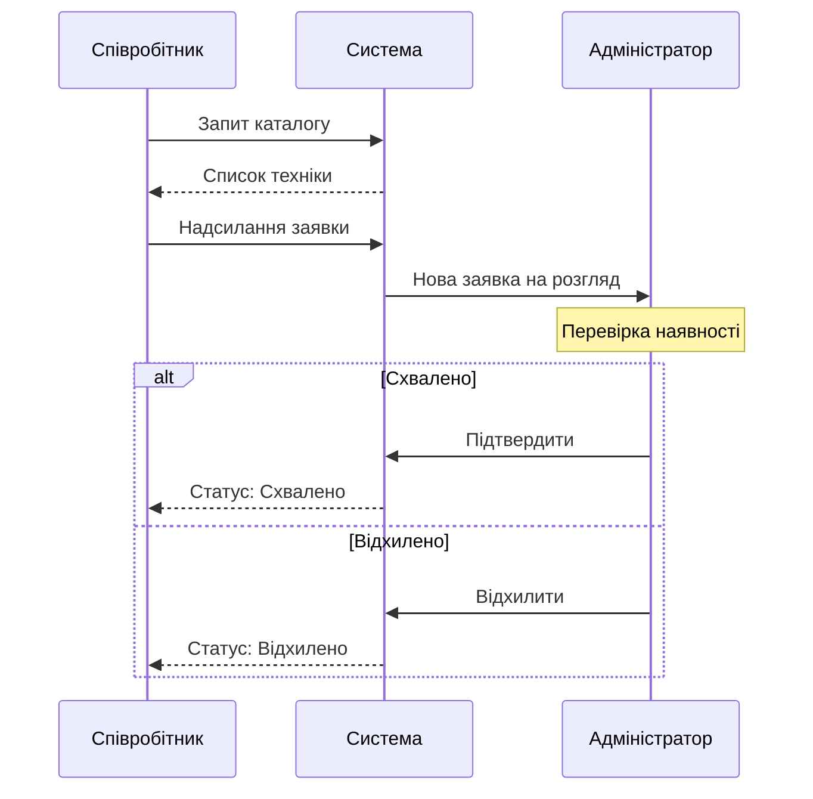
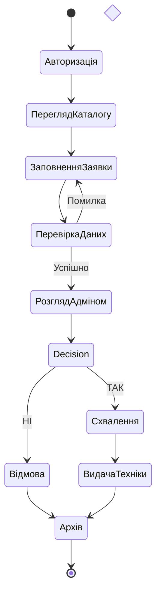

# Практична робота: Проєктування ІС за допомогою UML
**Студент:** Жданов С.О 
**Група:** 3101  

---

## 1. Діаграма варіантів використання (Use Case Diagram)

---

## 2. Діаграма послідовності (Sequence Diagram)

---

## 3. Діаграма діяльності (Activity Diagram)

У цій практичній роботі було спроєктовано систему замовлення IT-обладнання. За допомогою UML-діаграм продемонстровано:

1. **Діаграма варіантів використання (Use Case):** Визначає основні ролі (Співробітник, IT-Адмін) та їхні права в системі — від простого перегляду каталогу до управління складом та затвердження заявок.
2. **Діаграма послідовності (Sequence):** Показує покрокову взаємодію між користувачем, системою та адміністратором у часі. Деталізовано процес перевірки наявності техніки та зміну статусів заявки залежно від рішення.
3. **Діаграма діяльності (Activity):** Відображає логічний алгоритм обробки запиту: перевірку коректності введених даних, розвилки рішень адміністратора (схвалення або відхилення) та фінальні етапи (видача техніки з подальшим архівуванням).
